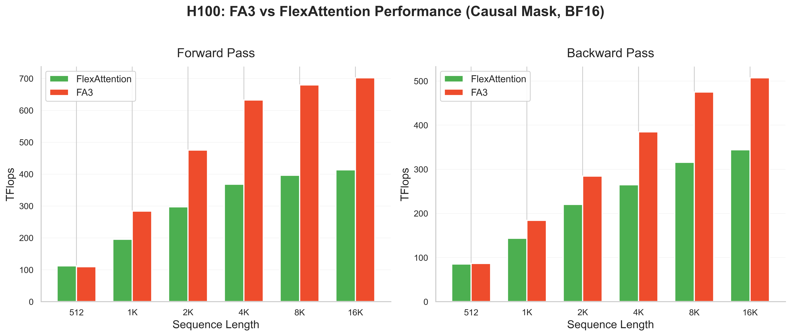
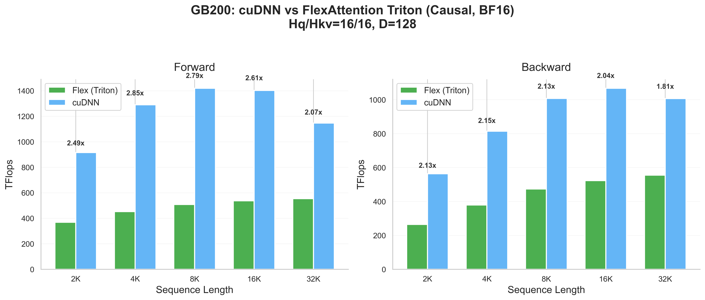
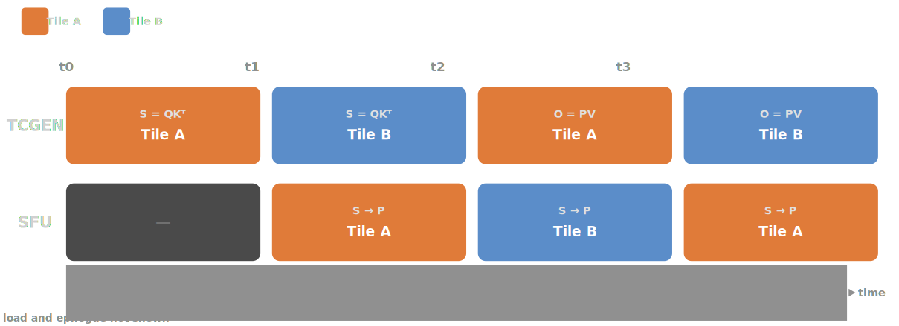
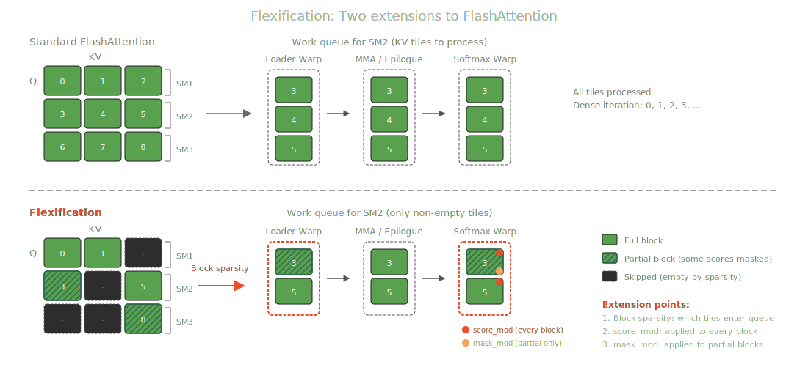
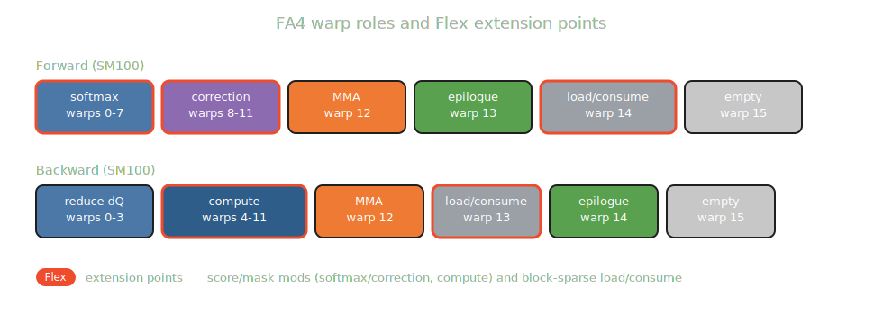
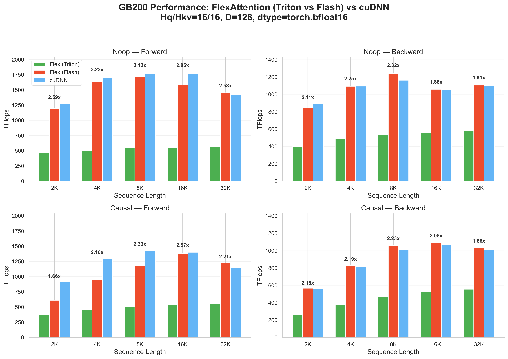
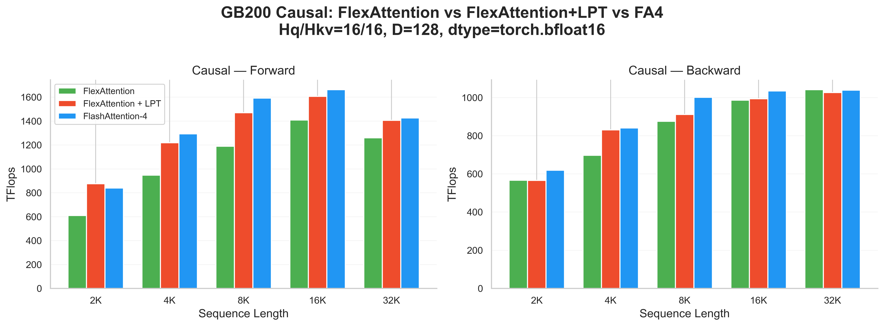
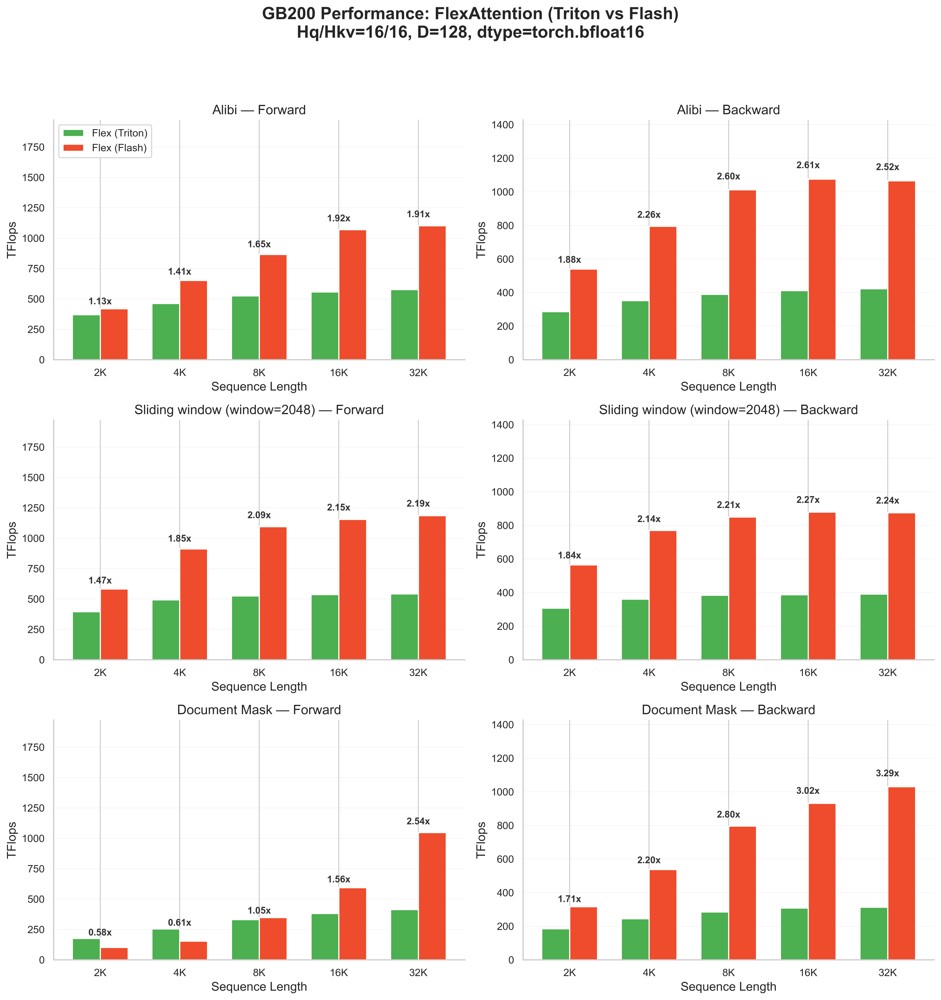
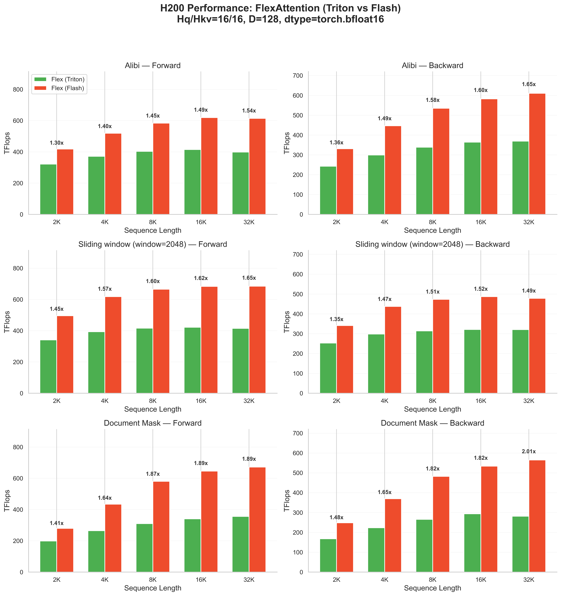
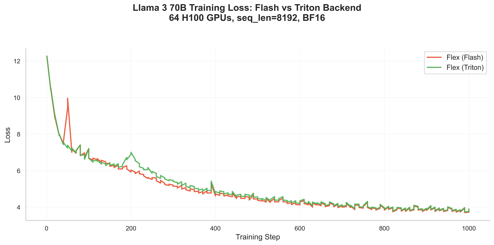

# FlexAttention + FlashAttention-4: Fast and Flexible


#### TL;DR:
On Hopper and Blackwell GPUs, FlexAttention now has a FlashAttention-4 backend.

We added support in PyTorch to automatically generate CuTeDSL score/mask modification functions, and to JIT-instantiate FlashAttention-4 for your custom attention variant.

This leads to performance gains of 1.2× to 3.2× over the existing Triton implementation on compute-bound workloads.

### FlexAttention recap
FlexAttention is a PyTorch API that lets you implement custom attention variants in a few lines of Python, no CUDA required. You write a `score_mod` or `mask_mod` function that modifies attention scores, and the compiler handles the rest: ALiBi, sliding window, document masking, soft-capping, and combinations of these all work through the same interface.

Under the hood, it's two extensions over vanilla FlashAttention:
1. Pointwise modifications to pre-softmax scores, with arbitrary loads from global memory.
2. Block-sparse iteration for both forward and backward, with a simple data structure for encoding data-dependent sparsity at runtime.

That's it. Of course, the devil is in the details, but as we've shown in [the original FlexAttention post](https://pytorch.org/blog/flexattention/) and [FlexAttention for inference](https://pytorch.org/blog/flexattention-for-inference/), these two extensions cover a wide range of popular attention variants.

With this release, FlexAttention now has a FlashAttention-4 backend. Here's how to use it:

```python
import torch
from functools import partial

from torch.nn.attention.flex_attention import flex_attention

flex_flash = torch.compile(
    partial(flex_attention, kernel_options={"BACKEND": "FLASH"}), dynamic=False
)

def local_boost(score, b_idx, h_idx, q_idx, kv_idx):
    return torch.where(torch.abs(q_idx - kv_idx) <= 8, score * 2, score)

B, H, S, D = 2, 8, 2048, 128
q = torch.randn(B, H, S, D, device="cuda", dtype=torch.bfloat16)
k = torch.randn(B, H, S, D, device="cuda", dtype=torch.bfloat16)
v = torch.randn(B, H, S, D, device="cuda", dtype=torch.bfloat16)
out = flex_flash(q, k, v, score_mod=local_boost)
```

Set `BACKEND: "FLASH"` to use the FA4 backend. You'll need a recent [PyTorch nightly](https://pytorch.org/get-started/locally/) and a recent [FlashAttention checkout](https://github.com/dao-AILab/flash-attention/tree/main/flash_attn/cute/README.md); check the install docs for version compatibility. This is actively developed code; expect some breaking changes as it stabilizes.

### Democratizing attention research with FlexAttention

FlexAttention was originally designed (and named) to provide flexibility to AI researchers when prototyping and experimenting with new attention variants. In practice, this has proven true: [dozens of papers cite FlexAttention](https://scholar.google.com/scholar?oi=bibs&hl=en&cites=6169255249999382801), and over a thousand repos have adopted it: 


While Flex has been successful at enabling researchers, a constant refrain from users is that they ultimately hit a performance ceiling that’s hard to break. At the time of the original blog post, we compared against FlashAttention-3 on Hopper GPUs and were roughly at 80% of its performance.

If you measure this today, FlexAttention achieves roughly 60% of FlashAttention-3's throughput, despite improvements to both implementations!




A common pattern emerges: researchers experiment with Flex, find something that works, then hit a wall when performance becomes critical. At that point, experts must port it to something lower-level. FlashAttention-3 has continued to add new args that extend functionality, but every new arg/pattern requires low-level rewrites. We’ve pushed the burden from researchers to ML engineers!


The delta in performance between fully optimized versions is perhaps worth the gain in flexibility on Hopper, but it’s a different story on newer Blackwell GPUs.

Let’s look at a comparison between FlexAttention using its existing Triton implementation (with all the autotune knobs maxed out) on a Blackwell GB200 GPU (running at 1000W), versus a highly optimized implementation like cuDNN attention available through PyTorch’s SDPA:


What was once a small gap has grown to a chasm! 

## Blackwell: bigger tensor cores, bigger problems

On Blackwell, high-performance attention requires a deeply pipelined, warp-specialized kernel. These techniques aren't expressible in our Triton-based implementation. We’d like to direct you to the great explanation of the FlashAttention kernel in [Reverse engineering FlashAttention-4](https://modal.com/blog/reverse-engineer-flash-attention-4), which details how the implementation leverages new hardware capabilities on Blackwell, plus updates to how softmax is computed. The name of the game, as always, is to keep the tensor cores busy; since they’ve only gotten faster, this requires heavy use of deep async pipelines.

Blackwell introduces Tensor Memory (TMEM), a programmer-managed scratchpad close to the tensor cores for intermediate results. More importantly, both data movement and matmuls are now fully asynchronous. A warp can kick off a matmul or load and immediately move on.

Warp specialization splits work into stages: some warps handle synchronous work like softmax (which needs registers), while others orchestrate the async pipeline by issuing loads and matmuls, and coordinating synchronization. Because the orchestration warps have low register pressure, more operations can stay in flight simultaneously, hiding latency.

The tensor cores got bigger and faster, but the special-function unit (SFU), which handles operations like exponentials, didn't keep pace. For forward attention, this shifts the bottleneck: softmax's exp() is now as expensive as the matrix multiplies. To keep the GPU fully saturated, you need to ping-pong between two tiles, overlapping one tile's matrix multiplies with the other's exponentiation. The timeline below shows how these phases alternate to hide latency.



Backward is even trickier. There isn't enough TMEM to hold all the accumulators at once, so the kernel needs careful pipelining to overlap computation with data movement while all shared, register, and tensor memory is under heavy pressure.

This is the kind of low-level choreography that a general-purpose compiler can't easily discover. As the [Gluon intro](https://github.com/triton-lang/triton/blob/main/python/tutorials/gluon/01-intro.py#L18-L26) puts it: "While the Triton compiler does a good job of generating efficient code for a wide range of kernels, it can be beaten by hand-tuned low-level code. When this happens, there is little the user can do to significantly improve performance since all the details are hidden." This is even harder for FlexAttention, which is a meta-attention implementation, so hardcoding compiler optimizations for specific patterns is difficult when the patterns are user-defined. Because of this, we started looking at lower-level implementations to see how best to improve performance on Blackwell.

## FlashAttention-4 as the foundation
There was a lot of flux in attention implementations for new Blackwell hardware. cuDNN added performant attention support early, but FA3 (the existing SOTA implementation on Hopper) did not work on Blackwell. WGMMA no longer exists on SM100: it has been replaced with TCGEN05 tensor core instructions, and tensor core ops require different memory spaces (tensor memory).

Tri Dao et al. started working on [FlashAttention-4](https://github.com/Dao-AILab/flash-attention/tree/main/flash_attn/cute), an updated version of the implementation that could take full advantage of the hardware.

One major change from FA3 to FA4 is [CuTeDSL](https://docs.nvidia.com/cutlass/latest/media/docs/pythonDSL/cute_dsl_general/dsl_introduction.html), a Python DSL recently released by the NVIDIA CUTLASS team for writing high-performance CUDA kernels using CUTLASS abstractions. SOTA attention implementations make heavy use of CUTLASS abstractions like `cute.Layout`s, but anyone who has tried to install FlashAttention knows how painful it can be, with long compile times. So while the idea of rewriting Flex in CUTLASS C++ has come up before, the dynamic nature of FlexAttention (and the overhead of compilation) made the premise less attractive. CuTeDSL enables authoring in Python what used to require CUTLASS C++, which makes JIT-style workflows more practical for FlexAttention.

After some early discussion with Tri about this path, we decided to join forces on this implementation for both FlexAttention and FlashAttention-4.

Rather than building a separate implementation, we collaborated to extend FA4 directly, sharing the same async pipeline infrastructure and adding extension points where FlexAttention needs to inject score modifications and sparsity.

This meant adding score-modification support to both forward and backward (by inlining score mods into the FlashAttention implementation) and adding support for the block-sparse metadata used in FlexAttention.

This work roughly split into two: changes to FA4 to produce FlexAttention template instantiations, and updates to Inductor to generate the required CuTeDSL code from its PyTorch representation.

## Inductor → CuTeDSL: the glue layer

So what do we need to produce for Flex? Pointwise modifications and arbitrary loads. Luckily, this isn’t the first time Inductor has done this, and there’s an existing mechanism for this kind of extension.
For instance, let's take a look at a score modification that can be used to implement ALiBi (fun fact: this was the motivating example for the flex-attention project).

Roughly speaking, `torch.compile` takes user code and transforms it through several IRs. These transformations produce increasingly lower-level representations. In the FX IR, you can still see familiar PyTorch operators, along with variables being set to `None` immediately after use. The AOTAutograd pass auto-generates the backward: since d/dx of (X + A) equals 1, the chain rule sends the gradient straight through.

Notably, no part of this stack needs to “know” what CuTeDSL code is until we get to Inductor, which ultimately produces the kernel code that gets run.

Click through the tabs below to see how ALiBi evolves from user code to the final CuTeDSL kernel.

[TODO confirm this modal works on final website]

<div class="code-transform-tabs" style="font-family: system-ui, -apple-system, sans-serif; margin: 2em 0;">
  <div style="display: flex; gap: 0; border-bottom: 2px solid #e5e5e5; margin-bottom: 0;">
    <button onclick="showTab(this, 'original')" class="tab-btn active" style="padding: 12px 20px; border: none; background: #ee4c2c; color: white; cursor: pointer; font-weight: 600; border-radius: 8px 8px 0 0; transition: all 0.2s;">Original</button>
    <button onclick="showTab(this, 'fx')" class="tab-btn" style="padding: 12px 20px; border: none; background: #e5e5e5; color: #666; cursor: pointer; font-weight: 600; border-radius: 8px 8px 0 0; transition: all 0.2s;">FX IR</button>
    <button onclick="showTab(this, 'aot')" class="tab-btn" style="padding: 12px 20px; border: none; background: #e5e5e5; color: #666; cursor: pointer; font-weight: 600; border-radius: 8px 8px 0 0; transition: all 0.2s;">AOTAutograd</button>
    <button onclick="showTab(this, 'cute')" class="tab-btn" style="padding: 12px 20px; border: none; background: #e5e5e5; color: #666; cursor: pointer; font-weight: 600; border-radius: 8px 8px 0 0; transition: all 0.2s;">CuTeDSL</button>
  </div>
  
  <div id="original" class="tab-content" style="display: block; background: #1e1e1e; border-radius: 0 8px 8px 8px; overflow: hidden;">
    <pre style="margin: 0; padding: 20px; overflow-x: auto;"><code style="color: #d4d4d4; font-family: 'Fira Code', Consolas, monospace; font-size: 14px; line-height: 1.6;"><span style="color: #569cd6;">def</span> <span style="color: #dcdcaa;">alibi_mod</span>(score, b, h, q_idx, kv_idx):
	scale = torch.exp2(-((h + 1) * 8.0 / H))
	bias = (kv_idx - q_idx) * scale
    <span style="color: #c586c0;">return</span> score + bias</code></pre>
    <div style="background: linear-gradient(to right, #ee4c2c22, #ee4c2c11); border-top: 1px solid #ee4c2c44; padding: 12px 20px; font-size: 13px; color: #b0b0b0;">
      <strong style="color: #ee4c2c;">User Code</strong>: A score modification that implements ALiBi, the motivating example for the flex-attention project.
    </div>
  </div>
  
  <div id="fx" class="tab-content" style="display: none; background: #1e1e1e; border-radius: 0 8px 8px 8px; overflow: hidden;">
    <pre style="margin: 0; padding: 20px; overflow-x: auto;"><code style="color: #d4d4d4; font-family: 'Fira Code', Consolas, monospace; font-size: 14px; line-height: 1.6;"><span style="color: #569cd6;">class</span> <span style="color: #4ec9b0;">score_mod_0</span>(torch.nn.Module):
    <span style="color: #569cd6;">def</span> <span style="color: #dcdcaa;">forward</span>(self, child, child_1, child_2, child_3, child_4):
        add: <span style="color: #ce9178;">"i32[][]cuda:0"</span> = child_2 + 1;  child_2 = None
        mul: <span style="color: #ce9178;">"f32[][]cuda:0"</span> = add * 8.0;  add = None
        truediv: <span style="color: #ce9178;">"f32[][]cuda:0"</span> = mul / 32;  mul = None
        neg: <span style="color: #ce9178;">"f32[][]cuda:0"</span> = -truediv;  truediv = None
        scale: <span style="color: #ce9178;">"f32[][]cuda:0"</span> = torch.exp2(neg);  neg = None
        sub: <span style="color: #ce9178;">"i32[][]cuda:0"</span> = child_4 - child_3
        bias: <span style="color: #ce9178;">"f32[][]cuda:0"</span> = sub * scale
        add_1: <span style="color: #ce9178;">"f32[][]cuda:0"</span> = child + bias
        <span style="color: #c586c0;">return</span> add_1</code></pre>
    <div style="background: linear-gradient(to right, #ee4c2c22, #ee4c2c11); border-top: 1px solid #ee4c2c44; padding: 12px 20px; font-size: 13px; color: #b0b0b0;">
      <strong style="color: #ee4c2c;">Dynamo → FX IR</strong>: This looks a little different from the original, but if you squint you can see familiar PyTorch operators, along with a lot of variables being set to <code style="background: #2d2d2d; padding: 2px 6px; border-radius: 3px;">None</code> quickly after use.
    </div>
  </div>
  
  <div id="aot" class="tab-content" style="display: none; background: #1e1e1e; border-radius: 0 8px 8px 8px; overflow: hidden;">
    <pre style="margin: 0; padding: 20px; overflow-x: auto;"><code style="color: #d4d4d4; font-family: 'Fira Code', Consolas, monospace; font-size: 14px; line-height: 1.6;"><span style="color: #569cd6;">class</span> <span style="color: #4ec9b0;">fw_graph0</span>(torch.nn.Module):
    <span style="color: #569cd6;">def</span> <span style="color: #dcdcaa;">forward</span>(self, arg0_1, arg1_1, arg2_1, arg3_1, arg4_1):
        add = torch.ops.aten.add.Tensor(arg2_1, 1)
        mul = torch.ops.aten.mul.Tensor(add, 8.0)
        div = torch.ops.aten.div.Tensor(mul, 32)
        neg = torch.ops.aten.neg.default(div)
        exp2 = torch.ops.aten.exp2.default(neg)
        sub = torch.ops.aten.sub.Tensor(arg4_1, arg3_1)
        mul_1 = torch.ops.aten.mul.Tensor(sub, exp2)
        add_1 = torch.ops.aten.add.Tensor(arg0_1, mul_1)
        <span style="color: #c586c0;">return</span> add_1

<span style="color: #569cd6;">class</span> <span style="color: #4ec9b0;">joint_graph0</span>(torch.nn.Module):  <span style="color: #6a9955;"># backward pass</span>
    <span style="color: #569cd6;">def</span> <span style="color: #dcdcaa;">forward</span>(self, arg0_1, ..., arg5_1):
        convert = torch.ops.prims.convert_element_type.default(arg5_1, torch.bfloat16)
        <span style="color: #c586c0;">return</span> [convert, None, None, None, None]</code></pre>
    <div style="background: linear-gradient(to right, #ee4c2c22, #ee4c2c11); border-top: 1px solid #ee4c2c44; padding: 12px 20px; font-size: 13px; color: #b0b0b0;">
      <strong style="color: #ee4c2c;">AOTAutograd</strong>: We auto-generate the backward pass. Here we have a very simple <code style="background: #2d2d2d; padding: 2px 6px; border-radius: 3px;">joint_graph</code>: since d/dx of (X + A) equals 1, the chain rule sends the backprop gradient straight through, with some data conversion if needed.
    </div>
  </div>
  
  <div id="cute" class="tab-content" style="display: none; background: #1e1e1e; border-radius: 0 8px 8px 8px; overflow: hidden;">
    <pre style="margin: 0; padding: 20px; overflow-x: auto;"><code style="color: #d4d4d4; font-family: 'Fira Code', Consolas, monospace; font-size: 14px; line-height: 1.6;"><span style="color: #dcdcaa;">@cute.jit</span>
<span style="color: #569cd6;">def</span> <span style="color: #dcdcaa;">score_mod</span>(tSrS_ssa, b_idx, h_idx, q_idx, kv_idx, seqlen_info, aux_tensors):
    tmp1 = tSrS_ssa.to(cutlass.Float32)
    tmp4 = (kv_idx - q_idx)
    tmp5 = tmp4.to(cutlass.Float32)
    tmp7 = (h_idx + cute.full_like(h_idx, 1))
    tmp8 = tmp7.to(cutlass.Float32)
    tmp9 = (tmp8 * cute.full_like(tmp8, 8.0))
    tmp10 = (tmp9 * cute.full_like(tmp9, 0.03125))
    tmp11 = -tmp10
    tmp12 = (tmp11 * cute.full_like(tmp11, 0.6931471805599453))
    tmp13 = cute.math.exp2(tmp12 * 1.4426950408889634)
    tmp14 = (tmp5 * tmp13)
    tSrS_ssa = (tmp1 + tmp14)

<span style="color: #dcdcaa;">@cute.jit</span>
<span style="color: #569cd6;">def</span> <span style="color: #dcdcaa;">score_mod_bwd</span>(grad_score_mod_ssa, tSrS_ssa, ...):
    grad_score_mod_ssa_out = grad_score_mod_ssa</code></pre>
    <div style="background: linear-gradient(to right, #ee4c2c22, #ee4c2c11); border-top: 1px solid #ee4c2c44; padding: 12px 20px; font-size: 13px; color: #b0b0b0;">
      <strong style="color: #ee4c2c;">CuTeDSL</strong>: TensorSSA expressions that run in register memory. Inductor produces this automatically from the FX graph.
    </div>
  </div>
</div>

<script>
function showTab(btn, tabId) {
  const container = btn.closest('.code-transform-tabs');
  container.querySelectorAll('.tab-content').forEach(t => t.style.display = 'none');
  container.querySelectorAll('.tab-btn').forEach(b => {
    b.style.background = '#e5e5e5';
    b.style.color = '#666';
  });
  const tab = container.querySelector('#' + tabId);
  if (tab) tab.style.display = 'block';
  btn.style.background = '#ee4c2c';
  btn.style.color = 'white';
}
</script>


Inductor lowers pointwise IR as a define-by-run function that calls `V.ops.<op>`, then swaps in a handler that reinterprets those calls for a target backend. In practice this shows up as `ops_wrapper(...)` and `OpsWrapper`, which let you map unary and binary primitives to a new language without changing the IR itself. For CuTeDSL, we plug in a CuTeDSL handler that rewrites those ops into TensorSSA expressions, so arithmetic is performed on register(RMEM) backed cute tensors and expressions can be CSE’d.

We also add a specialized load path for “arbitrary loads.” If a user writes a score/mask mod that relies on some global tensor, we materialize an RMEM fragment, and emit a load at the (possibly indirect) index. This lets us bridge from Inductor’s index expressions to CuTeDSL’s TensorSSA.

## Flexifying FlashAttention-4

We made two orthogonal extensions to FA4 so it can serve as FlexAttention’s backend:
1) score modification in forward and backward
2) block-sparse iteration in forward and backward

Both extensions are implemented in CuTeDSL so they can be inlined into the same async pipeline that makes FA4 fast.



Think of FlashAttention as processing a queue of KV tiles per SM. Flexification adds two hooks: block sparsity controls which tiles enter the queue (skipping empty blocks, marking partial blocks), while score/mask mods are applied as pointwise operations in the softmax warp.

<!-- 
Warp roles and extension points in FA4: we extend the softmax/correction and load/consume roles (plus backward compute), while leaving the MMA loop intact. -->

With that split in mind, here’s how the forward and backward hooks fit in.

### Score modification
One aspect of CuTeDSL that made this project feasible is the ability to not only pass a variadic number of kernel arguments to an implementation (which then lowers into a specific instantiation), but also to pass user callables directly. If you return to the core of FlexAttention, we need the ability to inject user modifications at precise points in the FlashAttention algorithm. We build on the existing FA4 implementation, which was already written to be score-mod friendly.

In forward, we bring the `S` tile back from TMEM into registers so we can apply the mod, compute row-wise max/sum, and generate the `P` tile for the second matmul. We define a CuTeDSL interface that mirrors FlexAttention’s `score_mod` signature and, instead of threading `N` variadic captures through the kernel, pass a list of `aux_tensors` that represent any global-memory regions used by the mod. Inside the kernel, we reinterpret register fragments as TensorSSA views (with optional vectorization) and inline the user callable on those tiles.

We already need `S` in registers to compute max/sum and form the `P` tile, so we apply score/mask mods while the data is resident in RMEM instead of adding a separate phase. That keeps the same pipeline structure and overlap between TCGEN and SFU work. Any extra reads from `aux_tensors` are issued directly when needed and scheduled alongside the existing stage that consumes `S`.

Backward follows the same interface shape with a generated `score_mod_bwd` callable, but the liveness story is different. In standard FA4, the `S` and `dS` tiles never need to be live at the same time, so TMEM can be shared across phases. With score mods, the backward path depends on what the user’s derivative needs.

If the gradient only depends on `P` (or the incoming gradient), we preserve the default schedule and still avoid `S`/`dS` overlap in TMEM. If the derivative depends on pre-softmax scores, we keep the needed `S` fragments in registers alongside `P` or `dS` and drop them as soon as their contribution is consumed. TMEM stays reserved for the main accumulators, and the cost is higher register pressure for those specific mods.

### Block-sparse iteration (forward + backward)
The second change FlexAttention requires from FlashAttention is block-sparse iteration. We extend FA4's kernels to accept block-mask metadata (the row/column tiles to visit) and drive the tile scheduler from it, so the kernel only touches the `(m, n)` tiles present in the mask. We also made the block-sparse path work with GQA packing and broadcasted head dimensions.

One consequence of the two-tile ping-pong from earlier: the minimum sparse block size on Blackwell is 256×128, up from 128×128 on the Triton path. Because each CTA processes two M-tiles to keep the pipeline full (`q_stage=2`), the smallest unit of work the scheduler can skip is 256 rows, so the block-mask granularity has to match.

Backward walks the same block-mask, computing gradients only for tiles present in the forward pass. The backward kernel already uses subtile iteration along rows, so the 256-row constraint fits naturally.

### What we contributed

These extensions required upstream updates across the FA4 stack:

- Score-mod hooks in forward and backward, including SM90/SM100 correctness fixes and GQA edge cases
- Block-sparse forward and backward paths for Blackwell and Hopper, plus pack-GQA support for broadcasted mask mods
- Interface cleanups for contig layouts and expanded tensors in the score/mask-mod path
- CuTeDSL bumps and TVM-FFI enablement to cut CPU dispatch overhead

With those pieces in place, let's look at the performance.

## Results

### Patterns supported by SDPA

For standard attention patterns like dense (noop) and causal masking, we can compare FlexAttention's new Flash backend against both the existing Triton implementation and cuDNN.



On GB200, the Flash backend achieves **1.6–3.2× speedup over Triton** for forward passes and **1.85–2.3× for backward**. For backward passes, Flash matches or even beats cuDNN in some cases; forward has a larger gap to cuDNN, particularly for causal attention.

You'll notice that for the forward pass, Noop matches cuDNN closely while Causal lags further behind. This gap highlights how much overhead block-sparse iteration adds compared to FA4's builtin Causal path.

#### Why causal lags (and how to close the gap)

After some investigation, one of the culprits is work scheduling: if you read through the [FA3 code](https://github.com/Dao-AILab/flash-attention/tree/main/hopper), you'll see the usage of [longest processing time first (LPT) scheduling](https://en.wikipedia.org/wiki/Longest-processing-time-first_scheduling), which FA4 implements for builtin causal but FlexAttention doesn't use. If we manually specify LPT scheduling, the performance looks like this:



With LPT scheduling manually specified, forward sees up to **1.6× speedup** at shorter sequences, tapering to ~1.1× at longer sequences. Backward sees minimal difference since the scheduling overhead is amortized differently. We still don't fully match the performance, but we are getting closer.

The LPT schedule works here since we know the specific sparsity pattern is causal and the schedule is optimal for this case. In general, we don't know the pattern ahead of time: block sparsity can be data-dependent, with different rows having different numbers of active KV blocks.

We could rely on CUDA to launch individual output tiles in a load-balanced manner, but then we would miss persistent scheduling gains from overlapping MMA & loads with epilogues and not repeating prologues.
This is exactly the problem that [Cluster Launch Control (CLC)](https://docs.nvidia.com/cutlass/latest/media/docs/cpp/blackwell_cluster_launch_control.html#dynamic-scheduler-with-cluster-launch-control) solves. CLC is a Blackwell feature that enables dynamic work scheduling: instead of statically dividing tiles across SMs at launch time, workers can query for new tiles on-the-fly. When one SM finishes early (because its row had fewer blocks to process), it immediately picks up the next available tile rather than sitting idle. CuTeDSL 4.4 added support for CLC-based persistent scheduling, which lets FlexAttention transparently benefit from better work distribution for block-sparse patterns without requiring users to specify a schedule.

### Patterns supported by FlexAttention

FlexAttention is really for patterns that SDPA doesn't support: ALiBi, document masking, sliding window and arbitrary user-defined score modifications.



For these Flex-only patterns on B200:
- **ALiBi**: 1.2–2.1× forward speedup, 1.9–2.9× backward speedup
- **Document mask**: Up to 2.7× forward, 3× backward at longer sequences
- **Sliding window**: 1.4–2.1× forward, 1.8–2.2× backward

### Hopper (H200) results

On Hopper GPUs, Flash is consistently faster across all sequence lengths.



For these Flex-only patterns on H200:
- **ALiBi**: 1.30–1.54× forward speedup, 1.36–1.65× backward speedup
- **Document mask**: 1.41–1.89× forward, 1.48–2.01× backward
- **Sliding window**: 1.45–1.65× forward, 1.35–1.52× backward

The gains are present even at shorter sequences (2K), with larger speedups as sequence length increases.


## Correctness and benchmark methodology

All benchmark numbers in this post were generated with [`attention-gym/benchmarks/flex_perf.py`](https://github.com/meta-pytorch/attention-gym/blob/main/benchmarks/flex_perf.py).

### Correctness

We validate the Flash backend by comparing outputs against an FP32 reference (cast Q/K/V to FP32, run attention, cast back). Upstream test suites continuously exercise these checks:

- **PyTorch Inductor**: a broad matrix of `score_mod` / `mask_mod` patterns (including captured buffers and views) and Flash-vs-Triton comparisons in [`test/inductor/test_flex_flash.py`](https://github.com/pytorch/pytorch/blob/main/test/inductor/test_flex_flash.py).
- **FlashAttention (CuTe)**: stress tests for `mask_mod` + block-sparsity across many (`seqlen_q`, `seqlen_k`) pairs, validating forward and backward against a `flex_attention` reference in [`tests/cute/test_mask_mod.py`](https://github.com/Dao-AILab/flash-attention/blob/main/tests/cute/test_mask_mod.py).

Beyond unit tests, we also validated the Flash backend in a real training setting: Llama 3 70B on 64 H100 GPUs with sequence length 8192 using [torchtitan](https://github.com/pytorch/torchtitan). Both runs converge to a final loss of ~3.7 over 1000 training steps:



### Limitations

**Block size constraints:**
For paged attention (like the vLLM integration), it's common to align kernel blocks to the page size. Today, the FA4 path is tuned around 128×128 blocks on Hopper and 256×128 on Blackwell (due to `q_stage=2`), with limited flexibility to change block sizes. As FA4 exposes more robust smaller `tile_m`/`tile_n` options, we plan to enable this feature.

**Dynamic Scalars**
Dynamic tensor shapes are fully supported and resolve at runtime. However, scalars captured in `score_mod` or `mask_mod` are baked into the compiled kernel. If you have a `soft_cap` value that changes between calls, each unique value triggers a recompilation:

```python
def tanh_softcap(score, b, h, q_idx, kv_idx):
    return soft_cap * tanh(score / soft_cap)
```

**Backward for captured buffers** that require gradients: Not currently supported in the Flash backend. For example, learnable bias tensors:
  ```python
  bias = torch.randn(seq_q, seq_kv, device='cuda', requires_grad=True)
  def bias_func(score, b, h, q_idx, kv_idx):
      return score + bias[q_idx, kv_idx]  # bias requires gradients
  ```
  The Triton backend supports gradients for captured buffers; use it for these cases.

**Deterministic backward with block-sparsity:** The Flash backend's backward pass is not yet deterministic when block-sparsity is enabled (score-mod-only workloads are deterministic). We're actively working on a fix for this.

**Performance limitations:**
- **Loads on the KV dimension in forward** can stall the pipeline, especially for pointer-chasing patterns (e.g., document masking with per-token metadata) where aux-tensor loads are hard to overlap with compute.
- **Backward with score_mods requiring pre-softmax scores** almost always spills registers with current tiling. For example, the gradient of `score**2` is `2 * score * grad_score`, which requires keeping pre-softmax scores live during the backward pass. TMEM is fully occupied by the main attention accumulators, and current block sizes rarely leave room in SMEM for the `S` tile, so it stays in registers and spills heavily, causing a noticeable slowdown.


## Future work

We're excited about CuTeDSL and the FA4 integration closing the gap between research and production.

On the Flash backend specifically, we're working on support for dynamic scalars captured in score mods without requiring recompilation (e.g., changing a `soft_cap` value between calls). Gradients for captured buffers will continue to rely on the Triton backend for the foreseeable future. We're also exploring dynamic persistent scheduling to improve work distribution across block-sparse patterns automatically.

While this article is about the FA4 implementation, the Triton implementation remains supported on a much wider range of hardware, and we plan to continue improving both backends.

## Thanks

This was a cross-repo collaboration.

The FlashAttention-4 kernel work (CuTeDSL implementation, scheduling, and the extension points needed for score/mask mods and block sparsity) lives upstream in `Dao-AILab/flash-attention`, while the compiler + integration work (FlexAttention API behavior, Inductor lowering, and CuTeDSL codegen) lives upstream in `pytorch/pytorch`.

Thanks to the maintainers, reviewers, and contributors in both repos, and to the NVIDIA CUTLASS/CuTeDSL team for building the abstractions that made a JIT-style workflow practical.

- FlashAttention / FA4 (kernel + extension points): Tri Dao, Ted Zadouri, Reuben Stern, Markus Hoehnerbach, Jay Shah
- PyTorch / Inductor (lowering + codegen + integration): Markus Hoehnerbach
- CuTeDSL / CUTLASS: Fung Xie

## Further reading / links
- [Attention Gym](https://github.com/meta-pytorch/attention-gym): example scripts and benchmarks for FlexAttention patterns
- [Colfax Research guide](https://research.colfax-intl.com/a-users-guide-to-flexattention-in-flash-attention-cute-dsl/): hands-on guide with `score_mod`/`mask_mod` examples
- [Reverse Engineering FlashAttention-4](https://modal.com/blog/reverse-engineer-flash-attention-4): deep dive into the FA4 kernel architecture
- [CuTeDSL Documentation](https://docs.nvidia.com/cutlass/latest/media/docs/pythonDSL/cute_dsl_general/dsl_introduction.html): NVIDIA's Python DSL for CUDA kernels
- [FlashAttention-4](https://github.com/Dao-AILab/flash-attention/tree/main/flash_attn/cute): FA4 implementation using CuTeDSL
